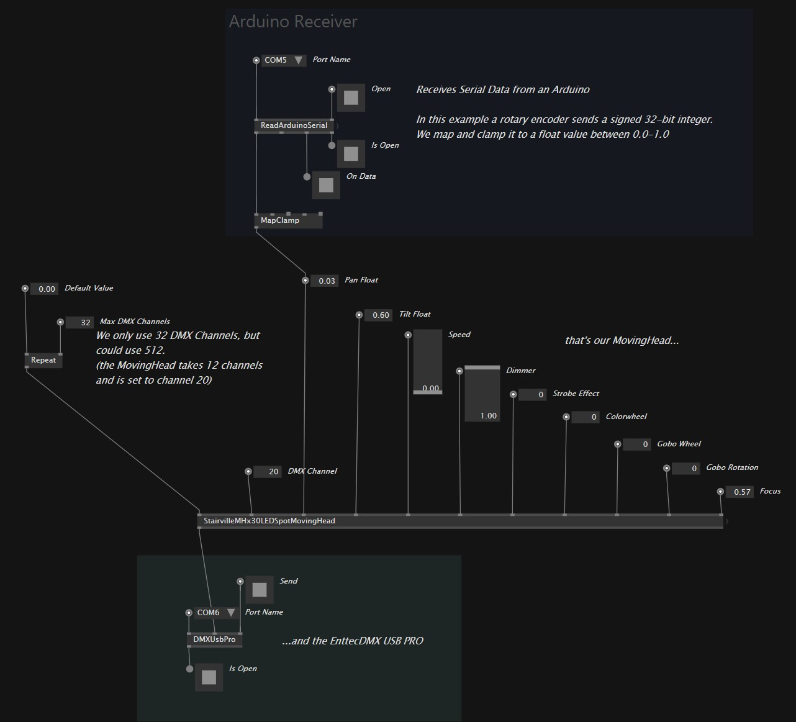
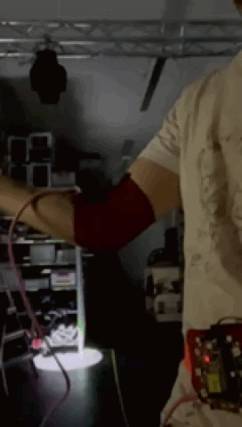

# VLDMX

This vvvv gamma patch is a basic example on how to **receive data via serial port** and **send it to an Enttec DMXUSB PRO** to control stage light.

## Quick How-To
### Arduino
```
int value = analogRead(A0);
Serial.println(value);
```

### vvvv gamma
* **download** from https://visualprogramming.net/
* **install the enttec nuget** with `nuget install VL.Devices.ENTTEC -pre`



### Spaghettimonster
Spaghettimonster is a wearable device to easily build prototype with textile body sensors. See: https://github.com/clockdiv/Spaghettimonster
Data is sent to vvvv over OSC, the principle is the same as with the arduino serial connection.


